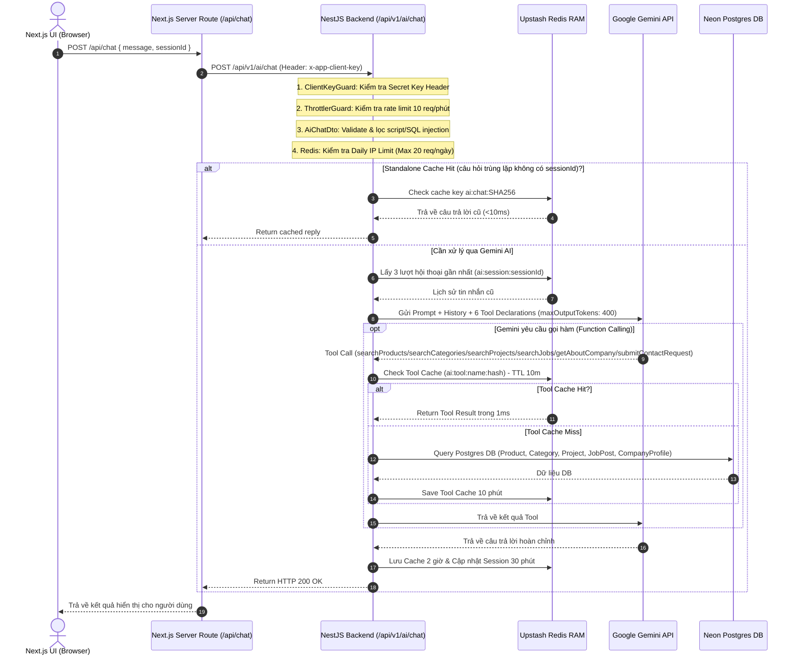

# 🤖 AI Chatbot Module & Integration Guide

Tài liệu chi tiết về kiến trúc, cấu hình, cơ chế bảo vệ anti-spam và **Hướng dẫn tích hợp cho Next.js Frontend** của Module AI Chatbot trong hệ thống `kien_dinh_ecm_be`.

---

## 📌 1. Kiến trúc & Sơ đồ Luồng (Architecture)

Module AI Chatbot hoạt động dựa trên cơ chế **RAG (Retrieval-Augmented Generation)** kết hợp **Multi-turn Function Calling** với SDK `@google/genai` (Gemini API) và **Upstash Redis Cache**.



---

## 🔑 2. Cấu hình Môi trường (`.env`)

Khai báo các biến môi trường sau trong file `.env` của Backend:

```env
# Gemini API Key & Model Config
GEMINI_API_KEY="YOUR_GEMINI_API_KEY"
GEMINI_FALLBACK_MODELS="gemini-3.5-flash,gemini-3.1-flash-lite,gemini-2.0-flash,gemini-2.0-flash-lite"
GEMINI_TEMPERATURE="0.7"

# Secret Key xác thực giữa Next.js Server Proxy và NestJS Backend
APP_CLIENT_SECRET="KienDinhECM_Secure_Client_Secret_2026_Key"

# Upstash Redis
UPSTASH_REDIS_REST_URL="https://first-moose-147955.upstash.io"
UPSTASH_REDIS_REST_TOKEN="YOUR_UPSTASH_TOKEN"
```

---

## 🛡️ 3. Ma trận Bảo vệ 5 Lớp & Tối ưu Free Tier

Để đảm bảo hệ thống **chạy ổn định 100% trên môi trường Free Tier** (Upstash Redis 256MB, Gemini Free 15 RPM, Neon Free DB) và chống hacker spam:

| Lớp bảo vệ | Cơ chế xử lý | HTTP Error |
| :--- | :--- | :--- |
| **1. Secret Client Key Header** | Bắt buộc có Header `x-app-client-key` khớp với `APP_CLIENT_SECRET`. Chặn toàn bộ bot/cURL bên ngoài. | `403 Forbidden` |
| **2. Burst Rate Limit** | Giới hạn tối đa **5 lượt / 60 giây** per IP qua NestJS `ThrottlerGuard`. | `429 Too Many Requests` |
| **3. Daily IP Limit** | Đếm số câu hỏi trong ngày. Giới hạn tối đa **20 câu / ngày** per IP lưu tại Redis. | `429 Too Many Requests` |
| **4. Input Sanitization** | Regex chặn `<script>`, `<iframe>`, `javascript:`, `SELECT `, `DROP TABLE`, Prompt Injection. | `400 Bad Request` |
| **5. Quản lý RAM & Tokens** | Ép `maxOutputTokens: 400`. Cache TTL **2 giờ** (`7200s`), Session History TTL **30 phút** (`1800s`), chỉ giữ **6 tin nhắn cuối** (3 lượt). | RAM luôn `< 5MB` |

---

## 💻 4. Hướng dẫn Tích hợp Phía Frontend (Next.js App)

Để giấu kín `APP_CLIENT_SECRET` không bị lộ ở Browser DevTools (`F12`), Frontend Next.js nên gửi Request qua **Server-Side API Route Proxy**.

### Bước 4.1: Tạo Route Proxy ở Next.js Server
Tạo file `app/api/chat/route.ts` trong dự án Next.js (`apps/user-next-app`):

```typescript
import { NextRequest, NextResponse } from 'next/server';

export async function POST(req: NextRequest) {
  try {
    const body = await req.json();
    const backendUrl = process.env.NEXT_PUBLIC_API_URL || 'http://localhost:8080';

    const response = await fetch(`${backendUrl}/api/v1/ai/chat`, {
      method: 'POST',
      headers: {
        'Content-Type': 'application/json',
        // Secret Key gửi từ Server Node.js của Next.js (Không bị lộ ở Browser F12)
        'x-app-client-key': process.env.APP_CLIENT_SECRET || 'KienDinhECM_Secure_Client_Secret_2026_Key',
      },
      body: JSON.stringify(body),
    });

    const data = await response.json();
    return NextResponse.json(data, { status: response.status });
  } catch (error: any) {
    return NextResponse.json(
      { success: false, message: 'Không thể kết nối tới máy chủ AI' },
      { status: 500 },
    );
  }
}
```

### Bước 4.2: Tạo Component Khung Chat ở Client (`ChatWidget.tsx`)

```tsx
'use client';

import { useState, useEffect } from 'react';

export default function ChatWidget() {
  const [messages, setMessages] = useState<Array<{ sender: 'user' | 'ai'; text: string }>>([]);
  const [input, setInput] = useState('');
  const [loading, setLoading] = useState(false);
  const [sessionId, setSessionId] = useState<string>('');

  // Tự sinh hoặc duy trì sessionId trong localStorage
  useEffect(() => {
    let sid = localStorage.getItem('ai_session_id');
    if (!sid) {
      sid = crypto.randomUUID();
      localStorage.setItem('ai_session_id', sid);
    }
    setSessionId(sid);
  }, []);

  const handleSendMessage = async () => {
    if (!input.trim() || loading) return;

    const userMsg = input.trim();
    setInput('');
    setMessages((prev) => [...prev, { sender: 'user', text: userMsg }]);
    setLoading(true);

    try {
      // Gọi qua Next.js API Proxy Route
      const res = await fetch('/api/chat', {
        method: 'POST',
        headers: { 'Content-Type': 'application/json' },
        body: JSON.stringify({
          message: userMsg,
          sessionId: sessionId,
        }),
      });

      const json = await res.json();

      if (json.success) {
        setMessages((prev) => [...prev, { sender: 'ai', text: json.data.reply }]);
        if (json.data.sessionId) {
          setSessionId(json.data.sessionId);
          localStorage.setItem('ai_session_id', json.data.sessionId);
        }
      } else {
        setMessages((prev) => [
          ...prev,
          { sender: 'ai', text: json.message || 'Có lỗi xảy ra, vui lòng thử lại.' },
        ]);
      }
    } catch (err) {
      setMessages((prev) => [
        ...prev,
        { sender: 'ai', text: 'Không thể kết nối tới server. Vui lòng kiểm tra lại mạng.' },
      ]);
    } finally {
      setLoading(false);
    }
  };

  return (
    <div className="chat-container">
      <div className="chat-messages">
        {messages.map((m, i) => (
          <div key={i} className={`msg ${m.sender}`}>
            {m.text}
          </div>
        ))}
        {loading && <div className="msg ai">Đang suy nghĩ...</div>}
      </div>
      <div className="chat-input">
        <input
          value={input}
          onChange={(e) => setInput(e.target.value)}
          onKeyDown={(e) => e.key === 'Enter' && handleSendMessage()}
          placeholder="Hỏi AI về máy phay, tiện, laser, địa chỉ..."
        />
        <button onClick={handleSendMessage} disabled={loading}>
          Gửi
        </button>
      </div>
    </div>
  );
}
```

---

## 🛠️ 5. Cấu trúc Hằng số Hệ thống ([ai.constants.ts](file:///Users/thanhbc/Documents/kien_dinh_ecm_be/src/modules/ai/constants/ai.constants.ts))

Tất cả các tham số cấu hình, giới hạn và thông báo văn bản của Module AI đều được quản lý tập trung:

- **`AI_HEADERS.CLIENT_KEY`**: `'x-app-client-key'`
- **`AI_LIMITS.MAX_INPUT_LENGTH`**: `300` ký tự
- **`AI_LIMITS.MAX_OUTPUT_TOKENS`**: `400` tokens (~250 từ)
- **`AI_LIMITS.DAILY_IP_LIMIT`**: `20` câu/ngày
- **`AI_LIMITS.MINUTE_RATE_LIMIT`**: `10` req/phút (Đã nâng cấp)
- **`AI_LIMITS.REDIS_CACHE_TTL_SEC`**: `7200` (2 giờ cho Standalone Cache)
- **`AI_LIMITS.REDIS_SESSION_TTL_SEC`**: `1800` (30 phút cho Session History)
- **`AI_LIMITS.REDIS_TOOL_CACHE_TTL_SEC`**: `600` (10 phút cho Tool Cache)
- **`AI_SYSTEM_PROMPT_TEMPLATE`**: Template System Prompt quản lý chuẩn hóa tập trung.
- **Danh sách 6 Tool Function Calling (`AI_TOOLS`)**:
  1. `searchProducts`: Tra cứu sản phẩm & thông số kỹ thuật `ProductDetail`.
  2. `searchCategories`: Tra cứu danh mục ngành hàng.
  3. `searchProjects`: Tra cứu các công trình/dự án thi công.
  4. `searchJobs`: Tra cứu tin tuyển dụng việc làm.
  5. `getAboutCompany`: Tra cứu giới thiệu, nhà máy, lịch sử công ty.
  6. `submitContactRequest`: Ghi nhận thông tin tư vấn / ứng tuyển.

---

## 🏗️ 6. Kiến trúc Strategy Pattern & Khả năng Bảo trì (Maintainability)

Toàn bộ logic Function Calling trong `AiService` được thiết kế theo **Strategy Pattern**:
- **Dispatcher Map (`toolHandlers`)**: Ánh xạ tên Tool ➔ Handler phương thức riêng biệt với độ phức tạp `O(1)`.
- **Phương thức Handler độc lập**: Mỗi Tool (`handleSearchProducts`, `handleSearchJobs`...) được cô lập trong phương thức private riêng biệt, giúp dễ dàng viết Unit Test, mở rộng hoặc sửa đổi mà không làm ảnh hưởng đến các Tool khác.

---

## 📄 7. Danh sách API Endpoints & Status Codes

### POST `/api/v1/ai/chat`
- **Auth:** Public (`@Public()`), Yêu cầu Header `x-app-client-key`.
- **Request Body:**
  ```json
  {
    "message": "Máy ép gạch TB 8.5+ giá bao nhiêu?",
    "sessionId": "c9b4a123-4567-89ab-cdef-0123456789ab"
  }
  ```
- **Response Success (200 OK):**
  ```json
  {
    "success": true,
    "statusCode": 200,
    "data": {
      "reply": "Máy Ép Gạch Không Nung TB 8.5+ hiện đang có giá bán theo hình thức Liên hệ báo giá. Thông số kỹ thuật nổi bật: Trọng lượng 3500 kg, 5 máy rung siêu mạnh...",
      "cached": false,
      "sessionId": "c9b4a123-4567-89ab-cdef-0123456789ab"
    },
    "timestamp": "2026-07-27T10:00:00.000Z"
  }
  ```
- **Response Errors:**
  - `400 Bad Request`: Tin nhắn rỗng, quá 300 ký tự hoặc chứa script/SQL injection.
  - `403 Forbidden`: Thiếu hoặc sai Header `x-app-client-key`.
  - `429 Too Many Requests`: Vượt quá 10 req/phút hoặc 20 req/ngày per IP.
