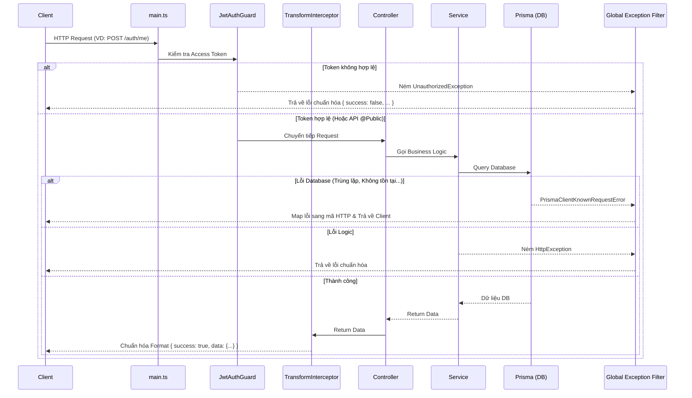

# Kien Dinh ECM Backend

Hệ thống Backend (NestJS + Prisma + Neon Serverless Postgres) cho dự án Kien Dinh ECM. 
Tập trung vào tính ổn định, dễ dàng scale (kiến trúc Module), và bảo mật (JWT Access + Refresh Token).

## 1. Công nghệ sử dụng
- **Framework:** NestJS (TypeScript).
- **Database ORM:** Prisma.
- **Database Engine:** Neon Postgres (Serverless).
- **Authentication:** JWT (Passport) tích hợp cơ chế Refresh Token.
- **Validation & Serialization:** `class-validator`, `class-transformer`.

---

## 2. Kiến trúc luồng xử lý (Request Flow)

Mọi HTTP Request từ Client gọi lên Server sẽ đi qua các lớp (Layers) bảo vệ và xử lý lỗi đồng nhất trước khi tới Logic chính, giúp code gọn gàng và không lặp lại.



---

## 3. Cấu trúc thư mục (Folder Structure)

```text
src/
├── app.module.ts              # Root Module (Nơi đăng ký Global Provider)
├── main.ts                    # Entry point (Cấu hình CORS, Global Pipes, Filters, Interceptors)
│
├── common/                    # Core dùng chung toàn hệ thống
│   ├── constants/             # Định nghĩa Error Codes, App Messages
│   ├── decorators/            # Custom Decorators (@Public, @CurrentUser)
│   ├── filters/               # Bắt và chuẩn hóa lỗi (HttpException, PrismaException)
│   ├── guards/                # Bảo vệ API (JwtAuthGuard)
│   ├── interceptors/          # Chuẩn hóa format Output cho Frontend
│   └── utils/                 # Các hàm tiện ích (Bcrypt Hash)
│
├── core/
│   └── config/                # Cấu hình siêu chặt chẽ cho biến môi trường (.env)
│
├── database/                  # Tầng kết nối Database
│   ├── prisma.service.ts      # Khởi tạo Prisma Client
│   └── prisma.module.ts       # Được đánh dấu @Global() để dùng ở mọi Module
│
└── modules/                   # Các tính năng nghiệp vụ (Business Logic)
    ├── auth/                  # Xử lý Login, Refresh Token, Logout
    └── users/                 # Quản lý Users (Lấy thông tin)
```

---

## 4. Luồng Authentication (Access Token & Refresh Token)

Hệ thống sử dụng cơ chế bảo mật cao cấp 2 lớp Token:

1. **Access Token** (Sống 15 phút):
   - Dùng để gửi kèm trên Header `Authorization: Bearer <token>` để truy cập API bảo mật.
2. **Refresh Token** (Sống 7 ngày):
   - Sinh ra cùng lúc khi Login.
   - Bị băm (Hash) bằng Bcrypt và lưu xuống Database.
   - Khi Access Token hết hạn, Frontend gửi Refresh Token lên endpoint `POST /auth/refresh` để xin 1 cặp Token mới.
   - Khi người dùng Logout, hệ thống gán `refreshToken = null` trong DB. Token cũ trên máy nạn nhân (nếu có) lập tức vô giá trị (Revoked).

---

## 5. Quy chuẩn viết Code (Coding Conventions)

1. **Format API Response chuẩn chung (do Interceptor lo):**
   ```json
   {
     "success": true,
     "statusCode": 200,
     "data": { ... },
     "timestamp": "2026-07-11T12:00:00.000Z"
   }
   ```
2. **Bắt lỗi:** KHÔNG BAO GIỜ dùng `try-catch` lồng ghép bừa bãi trong Controller/Service để ép trả JSON lỗi. Mọi lỗi cứ `throw new HttpException` hoặc để tự Prisma ném lỗi. Lớp Filter (`http-exception.filter.ts` & `prisma-client-exception.filter.ts`) sẽ lo bắt và chuẩn hóa thành format:
   ```json
   {
     "success": false,
     "statusCode": 400,
     "errorCode": "INVALID_CREDENTIALS",
     "message": "Mật khẩu không chính xác.",
     "timestamp": "...",
     "path": "/api/v1/auth/login"
   }
   ```
3. **Comment:** Chỉ viết JSDoc bằng tiếng Việt ngắn gọn, xúc tích (1-2 dòng) mô tả chức năng của hàm ở bên trên định nghĩa hàm. Tránh bình luận lê thê bên trong thân logic (inline comments).
4. **Export Constants:** Tất cả thông báo lỗi và error codes phải tập trung ở `common/constants` để dễ dàng bảo trì hoặc hỗ trợ i18n sau này.

---

## 6. Hướng dẫn chạy dự án

**Cài đặt:**
```bash
pnpm install
```

**Môi trường (.env):**
Copy file `.env.example` thành `.env` và điền đủ các thông tin: `DATABASE_URL`, `JWT_SECRET`, `JWT_ACCESS_EXPIRES_IN`, `JWT_REFRESH_SECRET`, `JWT_REFRESH_EXPIRES_IN`.

**Chạy Database Migration & Seed:**
```bash
npx prisma db push       # Hoặc npx prisma migrate dev
pnpm run seed            # Bơm tài khoản admin mồi
```

**Khởi chạy Dev:**
```bash
pnpm run start:dev
```
