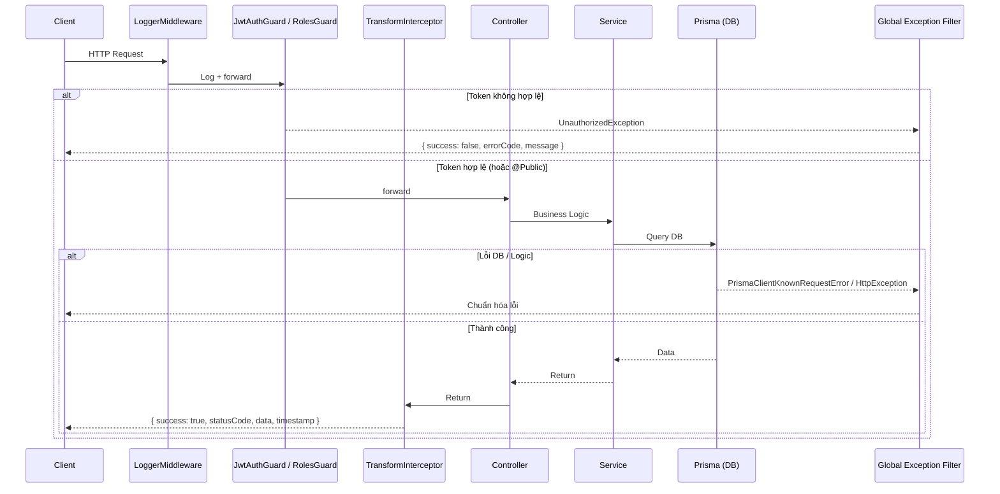

# Kien Dinh ECM Backend

Hệ thống Backend (NestJS + Prisma + Neon Serverless Postgres) cho dự án Kien Dinh ECM.  
Tập trung vào tính ổn định, dễ dàng scale (kiến trúc Module), và bảo mật (JWT Access + Refresh Token).

---

## 1. Công nghệ sử dụng

| Công nghệ | Mô tả |
|-----------|-------|
| **NestJS 11** | Framework TypeScript, kiến trúc Module |
| **Prisma 7** | ORM với type-safety đầy đủ |
| **Neon Postgres** | Serverless PostgreSQL |
| **JWT (Passport)** | Access Token + Refresh Token |
| **Cloudinary** | Upload & quản lý ảnh |
| **Swagger** | Tự động sinh API docs tại `/api/docs` |
| **Helmet** | HTTP security headers |
| **class-validator** | Validation & serialization DTO |

---

## 2. Kiến trúc luồng xử lý (Request Flow)

Mọi HTTP Request từ Client gọi lên Server sẽ đi qua các lớp bảo vệ và xử lý lỗi đồng nhất:



---

## 3. Cấu trúc thư mục

```text
src/
├── app.module.ts              # Root Module (Global Providers + LoggerMiddleware)
├── main.ts                    # Entry point (CORS, Global Pipes, Prefix, Swagger)
│
├── common/                    # Core dùng chung toàn hệ thống
│   ├── constants/             # Error Codes, App Messages
│   ├── decorators/            # @Public, @CurrentUser, @Roles
│   ├── filters/               # HttpExceptionFilter, PrismaClientExceptionFilter
│   ├── guards/                # JwtAuthGuard, RolesGuard
│   ├── interceptors/          # TransformInterceptor (chuẩn hóa output)
│   ├── middlewares/           # LoggerMiddleware (log mọi HTTP request)
│   ├── strategies/            # JwtStrategy (Passport)
│   └── utils/                 # HashUtil (bcrypt)
│
├── core/
│   └── config/                # Env validation + Swagger setup
│
├── database/
│   ├── prisma.service.ts      # Khởi tạo Prisma Client
│   └── prisma.module.ts       # @Global() — dùng được ở mọi Module
│
└── modules/
    ├── auth/                  # Login, Refresh Token, Logout, Me
    ├── users/                 # Quản lý Users
    ├── upload/                # Upload ảnh lên Cloudinary
    └── health/                # Health check endpoint (keep-alive)
```

---

## 4. Luồng Authentication (Dual Token)

Hệ thống sử dụng cơ chế 2 lớp Token:

| Token | TTL | Mục đích |
|-------|-----|----------|
| **Access Token** | `15m` | Gửi kèm `Authorization: Bearer <token>` để truy cập API |
| **Refresh Token** | `7d` | Lưu dưới dạng bcrypt hash trong DB. Dùng để xin cặp token mới |

**Flow:**
1. `POST /api/v1/auth/login` → Trả về `{ accessToken, refreshToken }`.
2. `POST /api/v1/auth/refresh` → Nhận `refreshToken`, xác thực hash, trả về cặp token mới.
3. `POST /api/v1/auth/logout` → Set `refreshToken = null` trong DB (revoke session).

---

## 5. Database Schema (Prisma + Neon)

**Database:** PostgreSQL serverless trên Neon. `PrismaService` được expose globally qua `@Global()`.

| Domain | Models | Ghi chú |
|--------|--------|---------|
| Admin auth | `User` | Roles: `SUPER_ADMIN`, `EDITOR`. Có field `refreshToken` (bcrypt hash). |
| Catalog | `Category` | Self-relation đệ quy cho danh mục nhiều cấp. |
| Products | `Product`, `ProductDetail`, `ProductImage` | Vertical partition: `Product` cho list-scan, `ProductDetail` chứa HTML + JSONB specs (1-1). |
| Projects | `Project`, `ProjectDetail`, `ProjectProduct`, `ProjectCategory` | Showcase liên kết products + categories qua join table tường minh. |
| Leads | `ContactRequest` | Status: `PENDING`, `CONTACTED`, `SPAM`. |
| Recruitment | `JobPost`, `JobPostDetail` | Cùng pattern 1-1 split như Product. |
| Config | `SystemSetting`, `CompanySlogan`, `CompanyTimeline` | Key-value site settings và About Us. |

**Kiến trúc chính:**
- **1-1 vertical partitioning**: Model nhẹ cho list-scan, model detail cho view chi tiết.
- **Slug fields**: Có trên mọi content model, unique — dùng làm public URL identifier.
- **Explicit M2M join tables**: Thay vì Prisma implicit M2M, cho phép mở rộng join-row sau này.

---

## 6. HTTP Request Logging

Mọi HTTP request được tự động log ra console qua `LoggerMiddleware`:

```
[Nest] LOG [HTTP] POST /api/v1/auth/login 201 772 - PostmanRuntime/7.51.1 ::1 [487ms]
```

**Format:** `[METHOD] [URL] [STATUS] [size] - [User-Agent] [IP] [Xms]`

- File: `src/common/middlewares/logger.middleware.ts`
- Dùng `Logger` built-in của NestJS (context: `HTTP`)
- Đo thời gian thực qua `response.on('finish', ...)`
- Đăng ký trong `AppModule.configure()` với pattern `'{*path}'` (NestJS 11+)

---

## 7. Monitoring & Keep-Alive (Render Free Tier)

Render Free Tier tự động "ngủ" sau **15 phút** không có traffic. Để tránh cold start:

### Health Check Endpoint

```
GET /api/v1/health
```

Trả về `{ status: 'ok', timestamp: '...' }`. Không cần JWT (`@Public()`). Cực nhẹ, không query DB.

### Cài đặt UptimeRobot (Miễn phí)

1. Đăng ký tại [uptimerobot.com](https://uptimerobot.com).
2. **Add New Monitor** → Monitor Type: `HTTP(s)`.
3. Điền URL: `https://<your-app>.onrender.com/api/v1/health`
4. Monitoring Interval: **14 phút** _(ping trước ngưỡng ngủ 1 phút để an toàn)_.
5. Thêm Alert Contact (email) để nhận thông báo khi server down.

---

## 8. Deploy lên Render

### Build Command (cấu hình trong Render Dashboard → Settings)

```bash
pnpm install --frozen-lockfile && pnpm dlx prisma generate && pnpm run build
```

> `prisma generate` bắt buộc phải có vì Render clone code mới từ Git, chưa có Prisma Client được sinh ra.

### Start Command

```bash
pnpm run start:prod
```

### Environment Variables (Render Dashboard → Environment)

Copy toàn bộ keys từ `.env.example` vào đây. **Lưu ý quan trọng:**
- **Không commit file `.env`** lên Git.
- **Không set `PORT`** — Render tự inject giá trị này.
- Nếu cần chỉ định Node version, thêm `NODE_VERSION = 22`.

---

## 9. Quy chuẩn viết Code

**Format response thành công (do `TransformInterceptor` xử lý tự động):**
```json
{
  "success": true,
  "statusCode": 200,
  "data": { "..." : "..." },
  "timestamp": "2026-07-12T04:00:00.000Z"
}
```

**Format response lỗi (do `HttpExceptionFilter` xử lý tự động):**
```json
{
  "success": false,
  "statusCode": 401,
  "errorCode": "INVALID_CREDENTIALS",
  "message": "Mật khẩu không chính xác.",
  "timestamp": "2026-07-12T04:00:00.000Z",
  "path": "/api/v1/auth/login"
}
```

**Rules:**
1. **KHÔNG dùng `try-catch`** trong Controller/Service để tự ép format JSON lỗi. Cứ `throw new HttpException(...)`, các Filter sẽ tự lo.
2. **Tập trung constants**: Mọi message lỗi và error code phải nằm trong `src/common/constants/`.
3. **Comment JSDoc**: Viết bằng tiếng Việt, ngắn gọn 1-2 dòng, mô tả chức năng hàm. Không inline comment lê thê trong logic.

---

## 10. Hướng dẫn chạy dự án (Local)

```bash
# 1. Cài đặt dependencies
pnpm install

# 2. Tạo file .env từ mẫu và điền đủ thông tin
cp .env.example .env

# 3. Đẩy schema lên DB + Generate Prisma Client
npx prisma db push
npx prisma generate

# 4. Seed dữ liệu mồi (tài khoản admin)
pnpm run seed

# 5. Chạy dev server (có hot-reload)
pnpm run start:dev
```

API docs có sẵn tại: `http://localhost:8080/api/docs`
