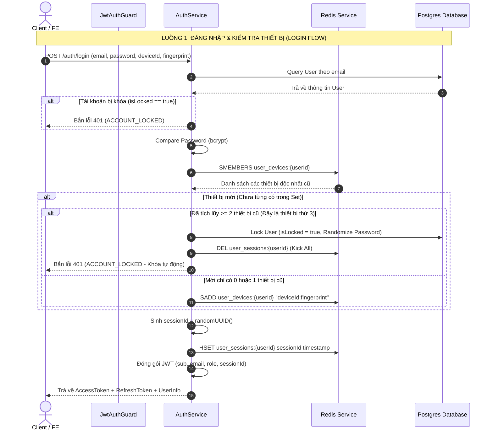
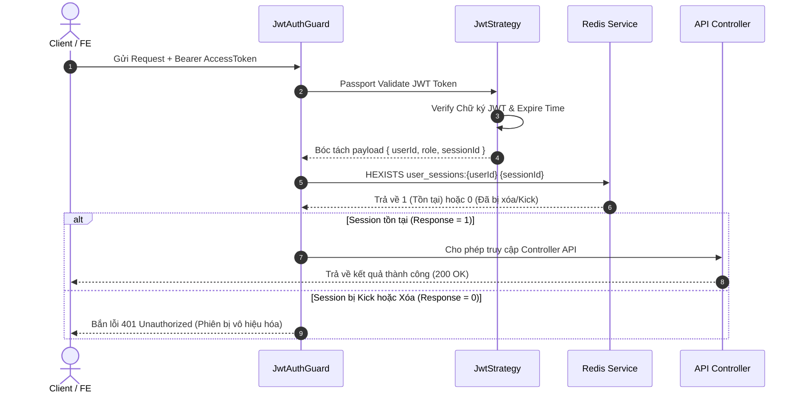
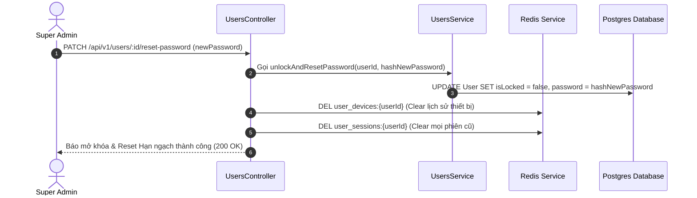

# ⚙️ CHUYÊN ĐỀ BẢO MẬT & WORKFLOW KIẾN TRÚC BACKEND (BE)

Tài liệu này chi tiết hóa toàn bộ luồng hoạt động nội bộ (Internal Workflow), cấu trúc dữ liệu Redis/DB và các thuật toán kiểm soát bảo mật phía Backend (NestJS).

---

## 🏗️ 1. CẤU TRÚC DỮ LIỆU & BỘ NHỚ (DATA STRUCTURES)

### A. Database Schema (PostgreSQL via Neon)
Bảng `User` lưu trữ trạng thái cố định:
- `role`: Enum (`SUPER_ADMIN` | `ADMIN`) - Phân quyền hệ thống.
- `isLocked`: Boolean (mặc định `false`) - Đánh dấu tài khoản bị khóa do vi phạm 3 thiết bị.
- `password`: String (Bị ngẫu nhiên hóa bởi `randomUUID()` khi bị khóa).

### B. Bộ nhớ tạm thời (Redis RAM Storage)
Nhằm đảm bảo tốc độ phản hồi microsecond và không làm quá tải Database:
1. **`user_devices:{userId}`** (Kiểu dữ liệu: **Redis Set**)
   - Chuỗi giá trị: `${deviceId}:${fingerprint}`
   - Mục đích: Lưu vĩnh viễn danh sách các thiết bị độc nhất từng đăng nhập.
2. **`user_sessions:{userId}`** (Kiểu dữ liệu: **Redis Hash**)
   - Key: `${sessionId}`, Value: `${timestamp}`
   - Mục đích: Theo dõi các phiên đăng nhập đang hoạt động. Khi bị xóa -> Lập tức vô hiệu hóa JWT Access Token.

---

## 🔄 2. CHI TIẾT WORKFLOW XỬ LÝ (DETAILED SEQUENTIAL FLOWS)

---

## 🛡️ 3. LUỒNG XÁC THỰC API & KICK TỨC THÌ (GUARD WORKFLOW)

Mọi API được bảo vệ bởi `JwtAuthGuard` sẽ trải qua quy trình kiểm tra 2 lớp:

---

## 🔓 4. LUỒNG CỨU HỘ & MỞ KHÓA TÀI KHOẢN (SUPER ADMIN UNLOCK WORKFLOW)

Khi một tài khoản bị khóa do thiết bị thứ 3 đột nhập:

---

## ⚡ 5. TỐI ƯU HIỆU NĂNG & AN TOÀN BỘ NHỚ (PERFORMANCE & OPTIMIZATION)

1. **Không tạoBottleneck cho Database**:
   - `JwtAuthGuard` kiểm tra `sessionId` thông qua lệnh `HEXISTS` trên Redis. Lệnh này có độ phức tạp thuật toán là $O(1)$, phản hồi trong khoảng **< 1 millisecond**, tuyệt đối không đụng đến PostgreSQL DB.
2. **Quản lý TTL (Time-To-Live)**:
   - Các `sessionId` trên Redis được đồng bộ vòng đời với JWT Access Token.
   - Khi Super Admin thực hiện Kick hoặc Reset Password, lệnh `DEL` xóa tức thì các Redis Key giúp giải phóng RAM ngay lập tức.
